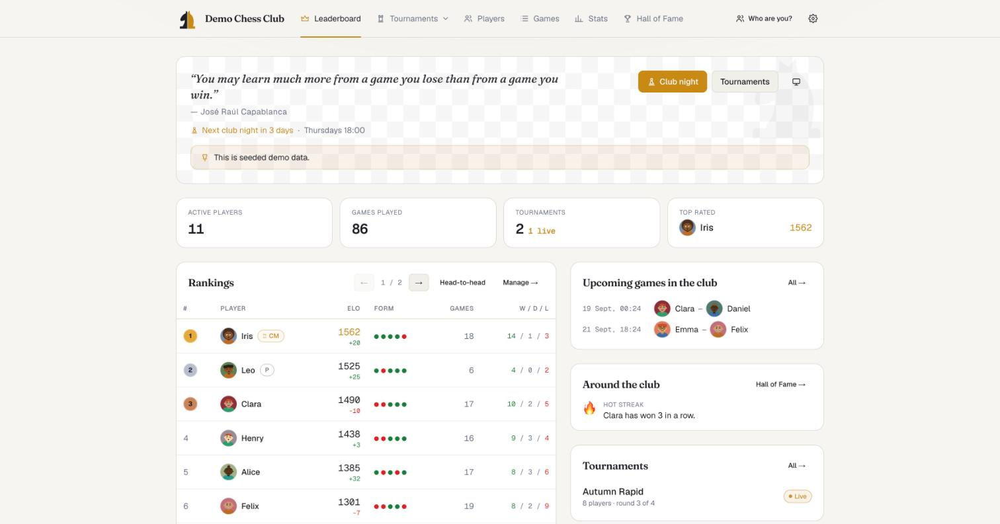
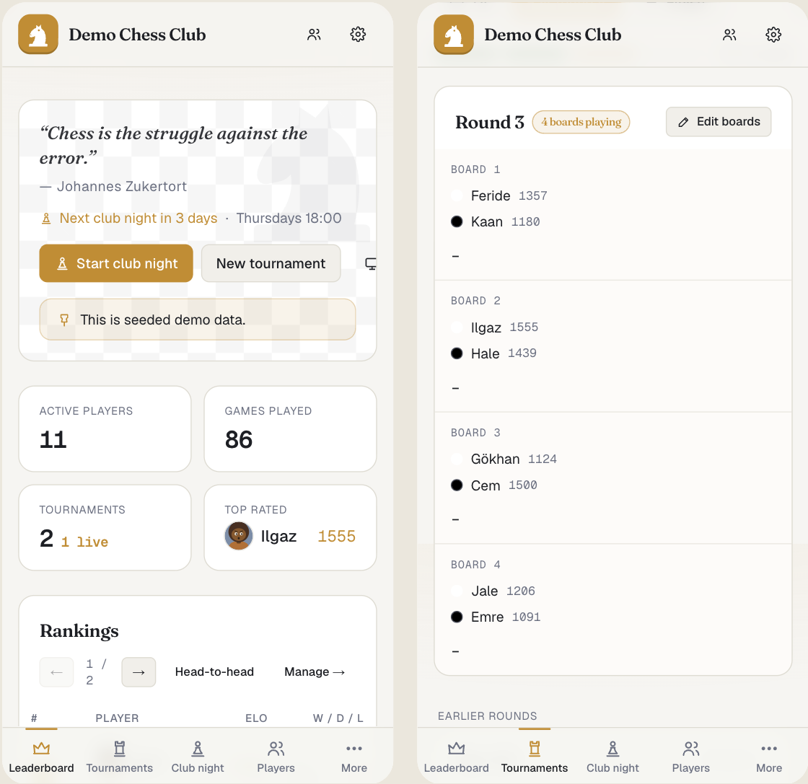
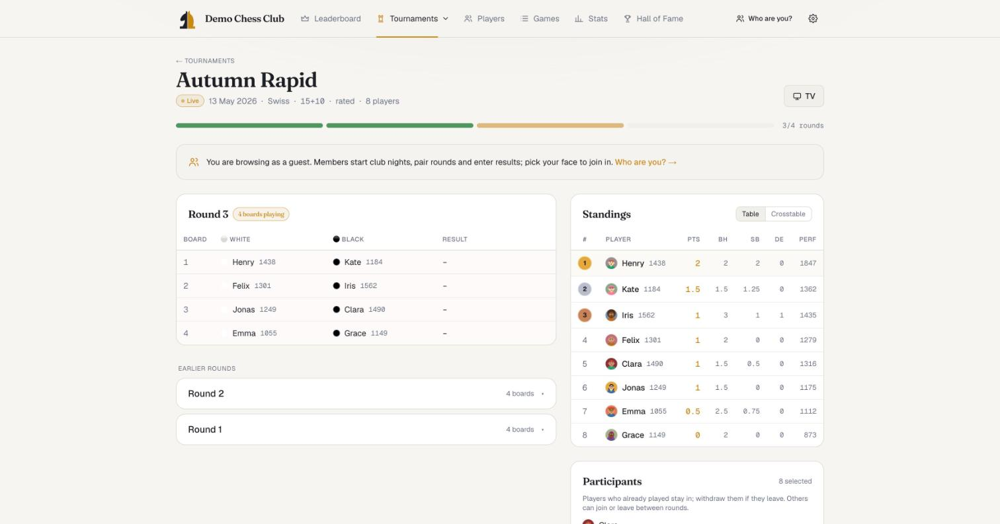
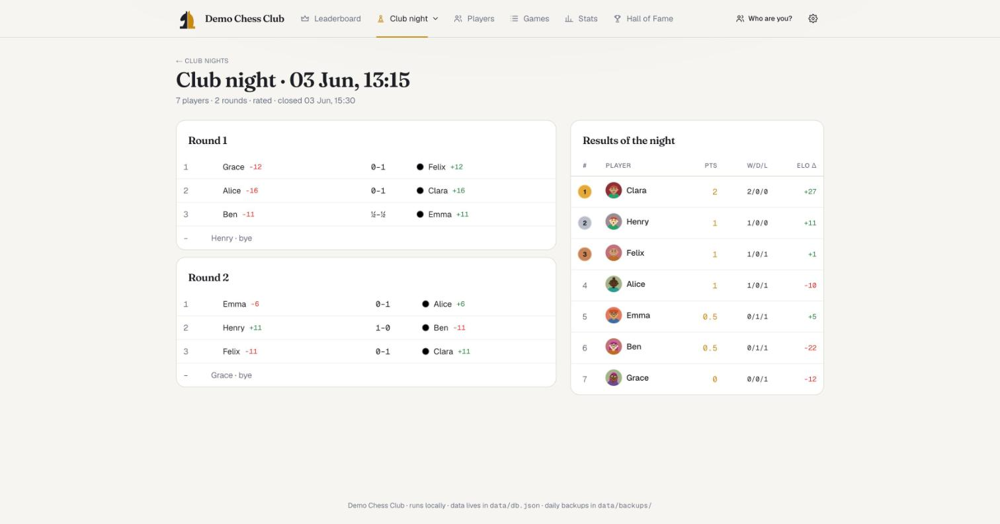
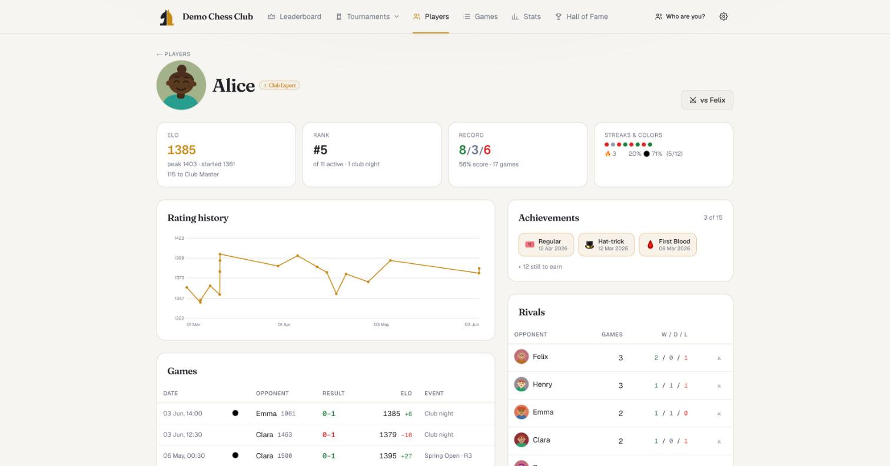
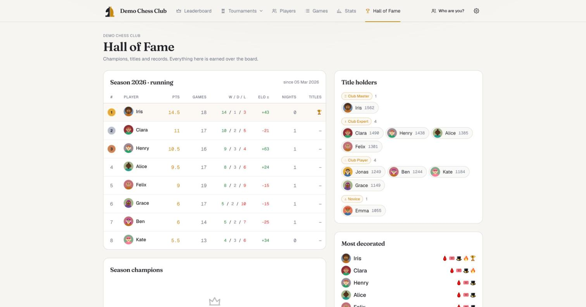
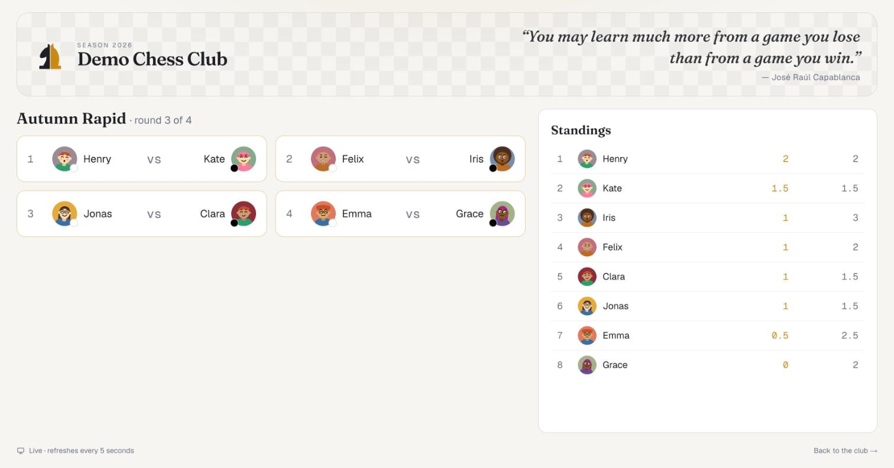
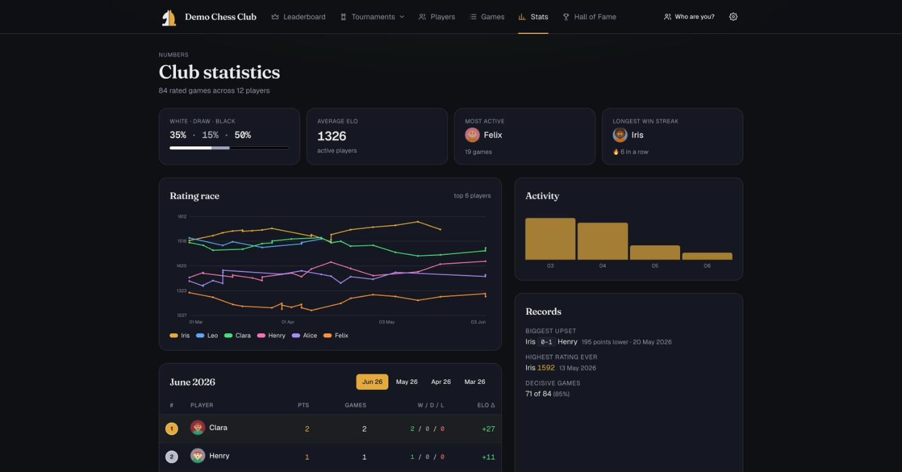
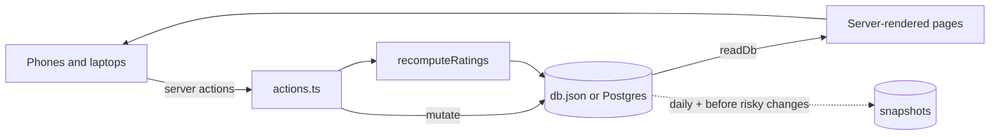

# Chess Club

**The whole club in one place: players and Elo, club nights, tournaments, seasons and a hall of fame.**
Runs on one laptop from a JSON file, or on Vercel with a free Postgres database. No accounts. English and German,
light and dark, phone friendly. Set up in ten minutes, used on club night from phones around the room.

<p align="center">
  
</p>

<p align="center">
  
</p>

## Contents

- [Who it is for](#who-it-is-for)
- [Quick start](#quick-start)
- [Features](#features)
- [Screenshots](#screenshots)
- [How it works](#how-it-works)
- [Configuration](#configuration)
- [Deploying to Vercel](#deploying-to-vercel)
- [Security](#security)
- [What it is not](#what-it-is-not)
- [Development](#development)
- [License](#license)

## Who it is for

A workplace or neighbourhood chess club of 5 to 50 people that meets regularly, wants a real rating list and the
occasional tournament, and does not want to manage user accounts. One person is the admin; everyone else opens the
address on their phone, taps their face, and enters their own results.

## Quick start

```bash
bun install
bun run dev              # http://localhost:5173
```

Open `/admin` once to create the admin password, add a few players, and start a club night. For phones on the same
Wi-Fi use `bun run dev:lan`; the Admin page shows the addresses and a QR code.

## Features

| | |
|---|---|
| **Elo ratings** | FIDE-style K factors, replayed from every game in order, so edits and deletions stay consistent. Forfeits count for standings, never for Elo. |
| **Club night** | Tick who is here, get random boards with balanced colours, play several rounds, results with undo. Late arrivals join, early leavers drop out. |
| **Tournaments** | Open pairing, Swiss, round robin (Berger) and knockout brackets with tiebreak games. Configurable tiebreaks, crosstable, performance rating, podium. |
| **Seasons and titles** | A season table with a champion crowned at the end; Club Player to Club Grandmaster titles by rating; achievements earned over the board. |
| **Hall of Fame and stats** | Champions, tournament winners, player of the month, records, rating race, activity per month. |
| **Identity without accounts** | Each device picks a face and a four-digit PIN once. Members start club nights, pair rounds and enter their own results; a device that has not picked a face only browses. |
| **Challenges** | Propose a game to another member with date, time and place; they accept, decline or suggest another time. Agreed games show on the home page, export to Google Calendar or any calendar app, and turn into a friendly game with one tap once played. |
| **TV screen** | `/tv` puts the live round and standings on the club room projector, refreshing every five seconds. |
| **Phone first** | Bottom tab bar, board cards with full-width result buttons, installable as a web app. |
| **Admin tools** | Snapshots, import and export, data health checks, duplicate merge, a danger zone with an undo path, activity log. |
| **Two languages, two themes** | English and German, light and dark, both chosen per device. |

## Screenshots

| Tournament, live | Club night |
|---|---|
|  |  |

| Player profile | Hall of Fame |
|---|---|
|  |  |

| TV screen | Stats, dark theme |
|---|---|
|  |  |

## How it works



- **One document.** The club is a single JSON document: players, games, tournaments, club nights, seasons, settings
  and an activity log. Locally it is `data/db.json`; on Vercel it is one row in Postgres. Old files are upgraded on every
  read.
- **Ratings are derived.** Nothing stores a rating by hand. After every change the games are replayed in order and
  the ratings recomputed, so a corrected result three weeks back simply flows through.
- **Server does the work.** Pages are server components, every change is a server action with its own authorisation
  check, and writes are versioned so two phones entering results at the same moment cannot overwrite each other.
- **Snapshots are the undo.** One automatic copy a day, plus one before every import, restore or bulk delete, plus the
  ones you take by hand. Restore from the Admin page.

## Configuration

| Variable | Purpose | Default |
|---|---|---|
| `DATABASE_URL` | Postgres connection string. Set on Vercel (Neon). Empty means the JSON file. | empty |
| `CHESS_DATA_DIR` | Folder for `db.json` and `backups/` in file mode. Handy for a second club or a test copy. | `./data` |
| `ADMIN_RESET_TOKEN` | Enables *Forgot the password?* on `/admin`. Set it, reset, remove it again. | empty |
| `NEXT_DIST_DIR` | Build folder, so a second instance does not fight the first one over `.next`. | `.next` |

Club-level settings (starting Elo, bye points, default tiebreaks, language, passwords, member code) live in the app
under Admin, not in the environment. A `.env.example` is included.

## Deploying to Vercel

1. Push the repo to GitHub and import it in Vercel. Bun is detected from `bun.lock`.
2. In the Vercel project open **Storage → Create Database → Neon** and connect it. This sets `DATABASE_URL`. Any
   Postgres works.
3. Deploy. The app creates its two tables on the first request.
4. Open `/admin`, create the admin password, then **Data → Import** your local `data/db.json` to carry the club over.
5. On **Security** set an owner password and a member code, so the public address is not an open door.

## Security

- **Admin password** – salted scrypt hash; the signed httpOnly cookie is bound to that hash, so changing the password
  signs every other admin device out.
- **Owner password** – optional second password for the destructive tools (danger zone, import and restore, deleting
  snapshots, merging players, member code, admin password, sign out everyone). Asked per action. The admin password
  alone cannot change it.
- **Member code** – optional shared code for the whole club, like a Wi-Fi password. Devices are remembered for 90 days;
  a new code signs everyone out.
- **Player PIN** – four digits per player; only that device (or the admin) can touch that player's results and profile.
  Devices without a claimed player are guests: every organising action is refused server-side, not only hidden.
- **Brute-force brake** – five wrong tries lock a PIN, password or code for ten minutes.
- **Sign out everyone** – rotates the cookie secret; every device signs in again.
- **Headers** – Content-Security-Policy, frame and sniffing protection, referrer and permissions policies, `noindex`.
- **Recovery** – set `ADMIN_RESET_TOKEN`, open `/admin` → *Forgot the password?*, choose admin or owner password, then
  remove the variable. Locally you can also delete the hash field from `data/db.json`.

## What it is not

- **Not a chess server.** It records results, not moves. No board, no clock, no engine.
- **Not a federation tool.** No DWZ, Elo or FIDE reporting, no PGN export.
- **Not multi-club.** One installation is one club. Run a second instance with another `CHESS_DATA_DIR` for another club.
- **Not a messenger.** Challenges let two members agree on a date, but nothing is pushed or mailed: people see what
  waits for them when they open the site (a badge in the header), or via the calendar file they can download.

## Development

```bash
bun test                 # unit tests in src/lib/__tests__
bunx tsc --noEmit
bun run lint
bun run build

# a second, isolated instance with its own data and build folder
CHESS_DATA_DIR=.demo-data NEXT_DIST_DIR=.next-e2e bun run dev -- -p 3001
```

Next.js 16 (App Router, server components and actions), Bun, Tailwind v4, `@neondatabase/serverless` and `qrcode`.
The domain logic (`src/lib`: Elo, pairing, knockout, standings, seasons, reset, merge, health, lockout, tokens) is pure
TypeScript with unit tests; pages and actions are thin on top of it. `CLAUDE.md` documents the conventions, and
`.claude/skills/` holds repo-specific skills for Claude Code (`check`, `seed-demo`, `inspect-db`, `new-action`,
`new-page`, `write-test`).

## License

[MIT](LICENSE)
